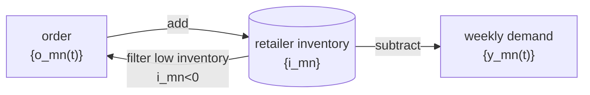

# Retail Order Prediction

Audit Current Solution and Design Document   Ali Khosro

## Requirements

### Setup

Client delivers M>600 materials to the (N>20000) stores of many cities in Mexico and Brazil based on their (weekly) demand and order. There is no supply constraint.

### Goal

For each store (n) and each material (m), predict next week (t) order (y): $ \hat y\_{mn}(t) $

### KPI

-   Maximum Prediction Accuracy

    i.e., minimize total "absolute" order errors (actual order minus predicted order):
    $$Accuracy = 1 - { \sum |e*{mnt}| \over \sum y*{mnt} }$$
    where
    $$e*{mnt} = y*{mnt} - \hat y\_{mnt}$$

-   Unbiased Prediction

    i.e., total order minus total predicted order)
    $$ bias = 1 - {|\sum \hat y*{mnt}| \over \sum y*{mnt}} $$

    > Negative bias means we are underestimating actual orders. Positive bias means we are overestimating orders: Client ships too many.

## AS IS

### Process

-   Step 0: Pre-processing data
    -   For each city and country, data preparation might be different
    -   **The organization of codes can be improved: separate standardizing input in separate module**
-   Step 1: Predict total order (unit: box) for each store
    -   using **LightGBM** model
-   Step 2: Predict each store order by each material
    -   Based on **wallet share of material** from last 3 months orders
-   Step 3: Round up units
    -   For smaller fractions, round up by product family
-   Step 4: Add orders from the "out of stock" model
    -   Affects 1% of the stores
-   Step 5: Make weekly prediction and daily adjustments of the model
    -   Model trains on weekly basis but there is daily adjustments as daily orders data arrives

### Result

| Step | Benchmark KPI | Model KPI | Model Bias |
| ---- | ------------- | --------- | ---------- |
| 1    | 35%           | 50%       | -12%       |
| 2    | -24%          | -13%      | -10%       |
| 3    | -24%          | -13%      | -5%        |

Benchmark is "repeat the last week's order" for each store

> Note: Negative KPI means it is worse than 100% wrong predictions (0 order prediction for every store => KPI=0%)
> Note: Negative Bias means underestimating orders

Conclusion: **Not a good predictive model** per store or per material.

> Note: covid disturbance might have a significant effect on the model's predictability

### Positive Aspects

There are many positive aspects in the current solutions that we are not covering.

-   The source codes are well developed and documented
    -   The notebooks are well structured
    -   For serious forecasting APIs, I recommend moving from notebooks to pure python code structure
-   The integration with pyspark and databricks is excellent
    -   Though it lacks "input standardizing" step from data quality perspective
-   The algorithm to predict demand works fine
    -   Input Transformation (order to demand) needs to be developed
    -   Output Transformation (demand to order) needs to be developed
    -   Virtual Inventory Tracker (to enable output transformation) needs to be developed
-   The train and test practice seems fine
    -   Time series data needs to be trained continuously (not a random split)
-   Technically, it is ready to scale
    -   It will be helpful to have "input standardizing" files in a separate Data Engineering step
    -   From the infrastructure perspective it is ready to scale
-   Security is considered
    -   There is no local development and dirty transfer of data

## Findings

### Local Inventory Ignored

Each store has an "in-store/local" inventory. The stores place an order for materials with low inventory.

The current prediction ignores the local inventories and assumes orders and demands (consumption) is the same. This is probably the biggest problem with the current modeling: we are predicting the consumption (demand) and not the orders.

We suggest adding a "virtual local inventory tracker" to the current modeling process to resolve this order<>demand transformation.

### Data Quality and Standard Input

It is difficult evaluate the data quality without comprehensive investigation and running tests.
It seems the input data has a data quality and moreover, it is not standard: its format changes for different regions. It will become a problem in scaling.

The suggestion is to have a separate module that deals with data conversion and standardizing data input to one coherent format.

### No Design Document

There is no design document to guide the data processing, model building, code development, and solution deployment.

At a minimum, the document needs to address

-   Problem and goal
-   KPI to evaluate the solution
-   Objective or hypothesis: technical articulation of the goal
-   Approach, process, and formulation (Conceptual Design)
-   Modeling (Logical Design)
-   Coding structure (Physical Design)
-   Deployment blueprint
-   KPI Result and summary

## Improvements

### Top-Down Modeling: Predict Material by Town >>> Breakdown by store

-   Current Approach: total order for store \* wallet share of material

    The current approach is "lets predict the total order by store and then breakdown by material proportionally" which seems not a proper approach.

    This approach might be fine for an "income based spending models". For example, "let us predict a household's income/budget for the next year and find their spending on vacation based on the wallet share". But for the current problem, we do not have such setting and this modeling won't work well.

-   Better Approach: total order for material \* market share of store
    Many of the macro level factors affect each material differently, but all regional stores similarly. For example "seasonality" effect is not much different from one store to the next store, but it is different from one material to another one. Therefore, it is wise to aggregate by region, not by material.

    First, we aggregate our orders by region (zip code, town, province, etc), then we predict the next week demand for each material in a given region, then we it breakdown to each store's demand through its market share.

### Categorize

Before formulating the solution, it is helpful to analyze the explanatory variables and treat them in different levels:

-   Macroeconomic forces affect all material and all stores (covid, income growth, population, etc) the same way
-   Seasonality influences all stores the same way, but each material differently
    -   We expect this variables to affect our prediction significantly

We have three variables (store, material, time) so we might have 6 different type of forces. From the above

## TO-BE Solution

### Process Design: Conceptual Solution

Before jumping into to-be solution, it is useful to review the actual process of placing an order by retailers:

-   At time t, retailer n orders a mix of m materials: $ \{y\_{nt}(m): m \in M\} $
-   The retailer stores all material boxes
-   Over the course of next few weeks, the retailer sells the materials
-   When low in inventory, the retailer orders and refills its inventory (go to step 1)

From the process, we conclude we need to develop a solution with three parts:

-   **Weekly Demand Prediction** prediction for each material and each retailer $ \set{ \hat y\_{mn}(t) } $

-   **Inventory Table** that simulates the retailers inventory status $ \set{ \hat i\_{mn}(t) } $

-   **Order Estimate** Order process that check if inventory has negative value (low inventory) and place an order $ \set{ \hat o\_{mn}(t) } $
    -   this can be challenging and it is the core of the problem

There will be two more parts:

-   Preprocessing of data
-   Main file that runs the process and pipeline

It is common to have side jupyter notebooks that explores data to select the correct models and features.

> Note: The current solution implements only one part and ignores the other two major parts of the solutions. Without the other two parts, the accuracy of the order prediction will be low.

### Formulation: Logical Solution

#### Converting orders to demand

Since we do not have the weekly or daily sale data, we need to convert the retailer's order to the weekly or daily demand.

The easiest way is to divide the order over the next days until the next order happens.
$$ y*{mn}(t1...t2) = {{o*{mn}(t1) - o\_{mn}(t2)} \over {t2-t1}} $$ where t1, t2 are times of two consecutive orders

#### curve fitting

As an optional step, we can smooth out the demands by curve-fitting.

#### Weekly Demand Prediction

We should not start with a blind modeling and a blind feature selection. We know:

-   The next week's demand is similar to the previous demand (markov chain effect)
    -   we use moving average for the previous demand
-   The next week seasonality is the same as last year
-   Seasonality affect all stores in a given town or nation.

We can build our base model based on these assumptions and then estimate the residuals for more elaborate modeling.

#### Markov Chain:

For each material m and store n, the next demand is similar to moving average of recent demands:
$$ y*{mn}(t+1) = \bar y*{mn}(t) + \epsilon\_{mn} $$

#### Seasonality

Seasonal effect $ \gamma $ is the same as last year (52 weeks) and it affects all stores the same way:
$$ \gamma_m(t) = \frac{y_m(t-52+1)}{y_m(t-52)} $$

#### Base Model

$$
y_{mn}(t+1) = \gamma_m(t) * y_{mn}(t) + \epsilon_{mn}
$$

Not only this model is a good start to predict demand, it takes into account auto correlation. Therefore, the errors will be mainly independent.

#### Model Residuals

Any other model building can be built on top of this: Estimate residuals of the Base model, instead of the predictions:

> Estimate $$ \hat e*{mn}(t+1) = y*{mn}(t+1) - \hat y\_{mn}(t+1) $$

Since we already subtract a major source of seasonality and auto-correlation, this residuals will not have significant correlation with each other. Therefore, we can estimate them from other external explanatory variables using LightGBM, RandomForest, GLM, etc. If we are still worried that the above base model is not good enough for time-series effects, we can apply ARIMA to the residuals before fitting to the external explanatory variables.

-   ARIMA (optional)
    $$ e*{mn}(t+1) ~ ARIMA(e*{mn}(t, t-1, ..., t-k)) $$
-   Regression (Improvement)

$$ e\_{mn}(t) = ML(X_1, X_2, ...) $$

Another approach would be clustering stores based on external variables, treating each cluster as one aggregated store, forecasting the aggregated stores (base model), finding market share of each store from the aggregated store. We can be very creative in this section to improve our model beyond the based model.
