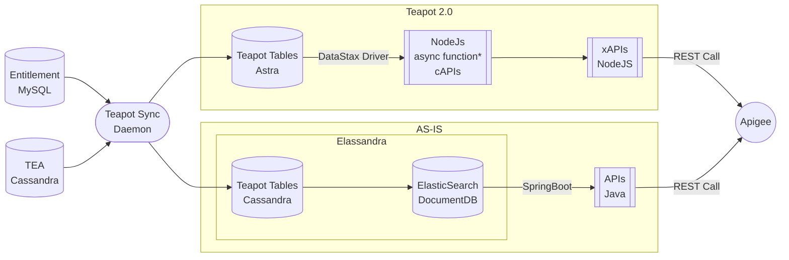

# Teapot
Astra + No ElasticSearch + streaming cAPI directly from DB + Nodejs APIs

# table structures
3 tables:
- org-user
- user-ban
- user-role
3 indices:
- user-index on user-role
- role-index on user-role
- user-index on user-ban
1 user defined type (line)
3 map collection types
- user_ban.msisdns (msisdn -> line)
- user_ban.roles (role -> boolean)
- user_role.roles  (role -> boolean)


| type | old api | new api | difference | performance | Link |
|-----|---------|----------|------------|------------|--------|
| xAPI | user-lines | user-lines | no diff | 2 times faster |  [link](#user-line) |
| xAPI | user-list | ban-users | diff in null values | 3 times faster |  [link](#user-list) |
| xAPI | user-bans | user-bans | diff in isBanShoppable | faster |  [link](#user-bans) |
| xAPI | manage-users | user-users | diff in last_login_time | similar |  [link](#users) |
| sync | start | start-sync | atomic update |  role by role vs entire org | [link](#sync) |
| sync | stop | stop-sync | the same | | |
| sync | update-org | update user, ban, msisdn | atomic update |  |
| cAPI | elastic-search query | user-bans | direct call db | streaming | |
| cAPI | none | user-lines | direct call db | streaming | |
| cAPI | elastic-search query | user-users | direct call db | streaming | |
| cAPI | elastic-search query | org-users | direct call db | streaming | |


## define variables
```bash
cd $HOME/tmo/teapot-demo
curl_output="./curl-output.json"
curl_output2="./curl-output2.json"
curl_output3="./curl-output3.json"
basic_token=$(cat basic.token)
#base="http://127.0.0.1:8080"
new_base="https://npe.analytics.ods.tfb.t-mobile.com:60000"
old_base="https://qlab01.core.op.api.t-mobile.com/b2b-experience"

measure="\nconnect-time\tstart-time\ttotal-time\n%{time_connect}\t%{time_starttransfer}\t%{time_total}\n\n\n"
format="-w $measure -o ${curl_output} -s"

orgId="1-29EQEMO"
userId="2-TMP-65230"
productType="AH"


billingAccount="990165566"
ban="990165566"
msisdn="2012330164"


old_base2="https://qlab02.core.op.api.t-mobile.com/b2b-experience"
orgId2="1-441BQBB"
userId2="1-48M96S3"
billingAccount2="111360873"


token=`curl --location --insecure --request POST 'https://qlab07.core.op.api.t-mobile.com/oauth2/v6/tokens' --header 'Accept: application/json' --header "Authorization: Basic ${basic_token}" --header 'Cache-Control: no-cache' --header 'Postman-Token: 1fa08c36-b7d8-5789-d4b0-200b3d14063e' --data '{}' | cut -b 14- | cut -f1 -d"\""`

clear
```

<!-- @import "[TOC]" {cmd="toc" depthFrom=1 depthTo=6 orderedList=false} -->

## ping-pong
make sure server is up and running
```bash
curl --insecure --request GET "$new_base/ping"
```


# xAPIs: compare, accuracy, streaming, performance
## org-users
```bash
					"raw": "{\"trace\":{\"userId\":\"1-41E11PO\"},\r\n\"roles\":[\"TEM\",\"ENDUSER\"],\r\n\"productType\":\"AH\",\"msisdnFilter\":\"ACTIVE\",\"banFilter\":\"ACTIVE\",\"pageNumber\":\"1\",\"pageSize\":\"99\",\"sort\":\"firstName\",\"sortOrder\":\"asc\"}"

data='{"trace": {"userId": "'$userId'"}, "roles":["BO", "TEM"], "productType": "'$productType'", "msisdnFilter": "ACTIVE", "banFilter": "ACTIVE", "pageNumber": "1", "pageSize": "99", "sort": "firstName", "sortOrder": "asc"}'

curl --location --insecure --request POST "$old_base/v2/b2b-billing-accounts/orgs/$orgId/users" --header 'Content-Type: application/json' --header 'Accept: application/json' --header 'B2b-Client: TFB-USERMANAGEMENT' --header "Authorization: Bearer ${token}" --data "$data" -w $measure -o ${curl_output} -s


curl --location --insecure --request POST "$new_base/b2b-experience/teapot-apis-service/v1/b2b-billing-accounts/orgs/$orgId/users" --header 'Content-Type: application/json' --header 'Accept: application/json' --header 'B2b-Client: TFB-USERMANAGEMENT' --header "Authorization: Bearer ${token}" --data "$data" -w $measure -o ${curl_output} -s

```


## user-line
>/b2b-billing-accounts/orgs/$orgId/users/lines

```bash
data='{"billingAccounts":["'$billingAccount'"],"msisdnFilter":"ACTIVE","productType":"'$productType'","userId":"'$userId'","sort":"status","sortOrder":"asc","pageNumber":"1","pageSize":"99"}'
clear
```


- current api: user-lines
```bash
### current api: user-lines
curl --location --insecure --request POST "$old_base/v2/b2b-billing-accounts/orgs/$orgId/users/lines" --header 'Content-Type: application/json' --header 'Accept: application/json' --header 'B2b-Client: TFB-USERMANAGEMENT' --header "Authorization: Bearer ${token}" --data "$data" -w $measure -o ${curl_output} -s

```

- proposed experience API: user-lines
```bash
### proposed api: user-lines
curl --location --insecure --request POST "$new_base/b2b-experience/teapot-apis-service/v1/b2b-billing-accounts/orgs/$orgId/users/lines" --header 'Content-Type: application/json' --header 'Accept: application/json' --header 'B2b-Client: TFB-USERMANAGEMENT' --header "Authorization: Bearer ${token}" --data "$data" -w $measure -o ${curl_output2} -s
```
 
- Accuracy
```bash
node ~/tmo/delta/delta.js ${curl_output} ${curl_output2}
```

- Performance
> New API is 50% faster because it streams and starts faster. Very useful to fetch large amount of data. Please notice different in `start-time`.
This is more obvious, when we call the new core API:


- proposed core api: user-lines
```bash
### proposed core api: user-lines
curl --location --insecure --request GET "${new_base}/capis/orgs/$orgId/users/$userId/lines?billingAccounts=$billingAccount&productType=$productType" --header 'Content-Type: application/json' --header 'Accept: application/json' --header 'B2b-Client: TFB-USERMANAGEMENT' --header "Authorization: Bearer ${token}" --data '{}'  -w $measure -o ${curl_output3} -s
```

- current core API

Since this is a complicated API, there is no simple elastic-search query to fetch data


## user-list
```bash
token=`curl --location --insecure --request POST 'https://qlab07.core.op.api.t-mobile.com/oauth2/v6/tokens' --header 'Accept: application/json' --header "Authorization: Basic ${basic_token}" --header 'Cache-Control: no-cache' --header 'Postman-Token: 1fa08c36-b7d8-5789-d4b0-200b3d14063e' --data '{}' | cut -b 14- | cut -f1 -d"\""`

data='{"orgId": "'$orgId'", "billingAccount": "'$billingAccount'", "productType": "'$productType'", "roles": ["TEM","BO"]}'

clear
```


```bash
# current api: users of a ban
curl --insecure --location --request POST "$old_base/v1/b2b-billing-accounts/users/user-list" --header "B2b-org: $orgId" --header 'Content-Type: application/json'  --header 'B2b-Client: TFB-USERMANAGEMENT' --header 'Accept: application/json'  --header "Authorization: Bearer ${token}" --data "$data" -w $measure -o ${curl_output} -s

# proposed xapi: ban users
curl --insecure --location --request POST "$new_base/b2b-experience/teapot-apis-service/v1/b2b-billing-accounts/users/user-list" --header "B2b-org: $orgId" --header 'Content-Type: application/json' --header 'Accept: application/json' --data "$data" -w $measure -o ${curl_output2} -s

```

- Accuracy
```bash
node ~/tmo/delta/delta.js ${curl_output} ${curl_output2}
```
> The treatment of null is different. No need for any change. But isBlocked does not agree which needs investigation.

- Performance
> it is 3 times faster. Mainly because of simple calls. It is because of direct read from DB by corresponding core API


- proposed core api: ban users

```bash
curl --location --insecure --request GET "${new_base}/capis/orgs/$orgId/billingAccounts/$billingAccount/users?productType=$productType&roles=BO,TEM" --header 'B2b-Client: SKAVA-SSP' --header 'B2b-org: 1-4H8XJAT' --header 'Content-Type: application/json' --header "Authorization: Bearer $token" --data "$data" -w $measure -o ${curl_output3} -s
```

- elastic-search
```bash
curl --location --insecure --request GET "http://qa2.cassandra-search-02.tfb.ccp.t-mobile.com:9200/org_assets_user_ban/_search?q=ban_number:$billingAccount&size=100" -w $measure -o ${curl_output3} -s
```


## user-bans
```bash
token=`curl --location --insecure --request POST 'https://qlab07.core.op.api.t-mobile.com/oauth2/v6/tokens' --header 'Accept: application/json' --header "Authorization: Basic ${basic_token}" --header 'Cache-Control: no-cache' --header 'Postman-Token: 1fa08c36-b7d8-5789-d4b0-200b3d14063e' --data '{}' | cut -b 14- | cut -f1 -d"\""`
clear
```

```bash
# current api: bans of a user
curl --insecure --location --request GET "$old_base/v2/b2b-billing-accounts/orgs/$orgId/users/$userId/billing-accounts?ban-filter=ALL&msisdn-filter=ALL&product-type=$productType" --header "B2b-org: $orgId" --header 'Content-Type: application/json' --header 'B2b-client: TFB-USERMANAGEMENT' --header 'Accept: application/json' --header "Authorization: Bearer $token" --data '' -w $measure -o ${curl_output} -s

# current api: bans of a user
curl --insecure --location --request GET "$new_base/b2b-experience/teapot-apis-service/v1/b2b-billing-accounts/orgs/$orgId/users/$userId/billing-accounts?ban-filter=ALL&msisdn-filter=ALL&product-type=$productType" --header 'B2b-client: TFB-USERMANAGEMENT' --header 'Accept: application/json' --header "Authorization: Bearer $token" --data '' -w $measure -o ${curl_output2} -s

```


- Accuracy
```bash
node ~/tmo/delta/delta.js ${curl_output} ${curl_output2}
```
> isShoppableBan recently has added to old api, we have no change our tablestructure. This causes more difference (bug in delta)

- Performance
> New API is slightly faster.


- proposed capi: user bans
```bash
curl --insecure --location --request GET "$new_base/capis/orgs/$orgId/users/$userId/bans?productType=$productType" --header 'B2b-client: TFB-USERMANAGEMENT' --header 'Accept: application/json' --header "Authorization: Bearer $token" --data '' -w $measure -o ${curl_output3} -s
```


# sync
- User table is not related to TEA anymore
  - It is independent inside org-assets and it has the same data as Entitlement
- Easily confugarable to handle concurrency
- Adding new columns is a config change, no code change is necessary
  - example: last_user_login
- Every update is atomic:
  - update user
  - update user-role
  - update ban-role
  - update msisdn-role
- Delay between Entitlement and Org-assets become virtually zero
  - we do not update the entire org or account anymore
  - We do atomic updates as entitlement streams role
- It is stateless srchitecture so it can be scaled horizentally as much we want
  - It can be deployed in conducktor or stateless solutions (aut-scale) like cloud-run, fargate
- It can be disintegrated from Entitlement and Feed from Kafka
- It is way simpler than before
- No need to intial loader any more

```bash
cd ~/teapot/teapot-sync-backup
source deploy/env-dev.sh
node --tls-min-v1.0 src/sync.js
```


# lesson learned for developers related to ASTRA
- Lightweight transactions (IF EXISTS or IF NOT EXISTS caluse in update and insert) can be a big blocker and cause timeout especially for Astra
  - Astra forces "Quorum" consistency for these statements it causes timeout in busy writes, more than Cassandra
  - Solution: Avoid it (refactor code), or simply first check if exists before updating (two statements: select, if exists write)
- Astra and Cassanra can not run together
  - Creating new instance of the client, confuses the previous setting
  - I could not connect to TEA (cassandra) and Teapot (Astra)
  - solution: Import client two times dynamically:
- Astra could not be connected from some Linux versions
  - redhat (we use), Mac, Windows are OK
  - Debian Buster still can not connect
  - It's a security incompatibility and will be solved I believe in future
- Corrupt Data
  - Example: timestamp ahead of time


# Capability APIs: Direct Calls vs Elastic-Search
The current system uses Elasticsearch as the capability APIs. The proposes uses DataStax client calls for cap APIs.
- Limitation: in proposed system, a call must have the partition key or be indexed (SAIs)


How many table,how many rows, how many index


```
cd ~/tmo/teapot-demo
url=http://npe.analytics.ods.tfb.t-mobile.com:50000
```


- /start-sync and stop sync
```
curl -X POST $url/start-sync -H 'content-type: application/json'
curl -X POST $url/stop-sync -H 'content-type: application/json'
```


### org-user table

```
curl -X POST $url/update-user -H 'content-type: application/json' -d @./user.json

curl -X GET $url/org-user?org_id=MS-1191851\&user_id=2-TMP-55894286

http://npe.analytics.ods.tfb.t-mobile.com:8001/org-user?org_id=MS-1191851&user_id=2-TMP-55894286
```


### user_roles
```
curl -X POST $url/update-user-role -H 'content-type: application/json' -d @./user-role.json

curl -X GET $url/user-roles?org_id=MS-1191851\&user_id=2-TMP-56275164\&product_type=AH\&asset_type=user

http://npe.analytics.ods.tfb.t-mobile.com:8001/user-roles?org_id=MS-1191851&user_id=2-TMP-56275164&product_type=AH&asset_type=user
```

### ban_roles
```
curl -X POST $url/update-ban-role -H 'content-type: application/json' -d @./ban-role.json

curl -X GET $url/ban-roles?org_id=MS-1191851\&user_id=2-TMP-56275164\&product_type=AH\&asset_type=user

http://npe.analytics.ods.tfb.t-mobile.com:8001/user-roles?org_id=MS-1191851&user_id=2-TMP-56275164&product_type=AH&asset_type=user
```

### user-list
```

# old
curl --location --request POST 'https://qlab02.core.op.api.t-mobile.com/b2b-experience/v1/b2b-billing-accounts/users/user-list


# new

```


## DEMO
# teapot APIs
- install browser extension jsonlite (or any json viewer)
- export basic_token as an environmental variable
- get token
- fetch your api
- in your browser/viewer open ${curl-output} to view the output
- tip: add --insecure switch to curl command
- tip: remember bash variables are not define in single quotation:
    - 'Basic ${basic_token}': wrong => "Basic ${basic_token}": right


<script src="https://cdn.jsdelivr.net/npm/curl-parser-js@0.0.3/dist/parse-curl.js"></script>

<script src="https://unpkg.com/mermaid@8.8.0/dist/mermaid.min.js"></script>


## Architecture



# tables
```sql
CREATE TABLE IF NOT EXISTS org_user (
    org_id text,

    user_id text,
    
    uuid text,
    email text,
    first_name text,
    last_name text,
    roles map<text, text>, --  {role: product_type}
    blocked_portals set<text>,
    
    PRIMARY KEY (org_id, user_id)
) WITH CLUSTERING ORDER BY (user_id ASC);


CREATE TYPE line (
    end_user text,
    status_code text,
    line_identifier_1 text,
    line_identifier_2 text,
    line_identifier_3 text,
    product_type text,
    line_type text
);


CREATE TABLE IF NOT EXISTS user_roles ( -- from org1 user ali has {tem,bo} roles over resource msisdn '1111:2222'
    org_id text,
    product_type text,
    asset_type text,
    
    user_id text,
    asset_id text,
    
    asset_status text,
    roles map<text, boolean>, --{TEM: true, BO: false}

    upstream_last_update timestamp,

    PRIMARY KEY ((org_id, resource_type, product_type), asset_id, user_id)
) WITH CLUSTERING ORDER BY (asset_id ASC, user_id ASC);


CREATE TABLE IF NOT EXISTS user_ban (
    org_id text,
    product_type text,
    user_id text,

    ban_number text,

    ban_roles map<text, boolean>, -- {role: active}
    msisdns map<text, frozen<line>>, -- {msisdn1: line}
    users map<text, frozen<set<text>>>, -- {user_id: [role]}

    account_sub_type text,
    account_type text,
    ban_friendly_name text,
    ban_status text,
    ibilling_enabled boolean,
    ibilling_org_id text,

    upstream_last_update timestamp,


    PRIMARY KEY ((org_id, product_type, user_id), ban_number)
) WITH CLUSTERING ORDER BY (ban_number ASC);


CREATE CUSTOM INDEX user_index ON user_role (user_id) USING 'StorageAttachedIndex';
CREATE CUSTOM INDEX role_index ON user_role (keys(roles)) USING 'StorageAttachedIndex';

CREATE CUSTOM INDEX userban_index ON user_ban (user_id) USING 'StorageAttachedIndex';
```

-----------------
--------
END

<script>
// get the list of all highlight code blocks
const highlights = document.querySelectorAll("code")

highlights.forEach(div => {
  // create the copy button
  const copy = document.createElement("button")
  copy.innerHTML = "Copy"
  // add the event listener to each click
  copy.addEventListener("click", handleCopyClick)
  // append the copy button to each code block
  div.append(copy)
})


const copyToClipboard = str => {
  const el = document.createElement("textarea") // Create a <textarea> element
  el.value = str // Set its value to the string that you want copied
  el.setAttribute("readonly", "") // Make it readonly to be tamper-proof
  el.style.position = "absolute"
  el.style.left = "-9999px" // Move outside the screen to make it invisible
  document.body.appendChild(el) // Append the <textarea> element to the HTML document
  const selected = document.getSelection().rangeCount > 0 ? document.getSelection().getRangeAt(0) : false

  el.select() // Select the <textarea> content
  
  document.execCommand("copy") // Copy - only works as a result of a user action (e.g. click events)
  document.body.removeChild(el) // Remove the <textarea> element
  if (selected) {
    // If a selection existed before copying
    document.getSelection().removeAllRanges() // Unselect everything on the HTML document
    document.getSelection().addRange(selected) // Restore the original selection
  }
}

function handleCopyClick(evt) {
  // get the children of the parent element
  const { children } = evt.target.parentElement
  // grab the first element (we append the copy button on afterwards, so the first will be the code element)
  // destructure the innerText from the code block
  const { innerText } = Array.from(children)[0]
  // copy all of the code to the clipboard
  copyToClipboard(innerText)
  // alert to show it worked, but you can put any kind of tooltip/popup to notify it worked
}
	
</script>

<script src="https://cdn.jsdelivr.net/npm/mermaid/dist/mermaid.min.js">
    
</script>


## nodes

/b2b-experience/teapot-apis-service/v2/b2b-billing-accounts/orgs/:orgId/users
/b2b-experience/v2/b2b-billing-accounts/orgs/1-41DQLNU/users
# end