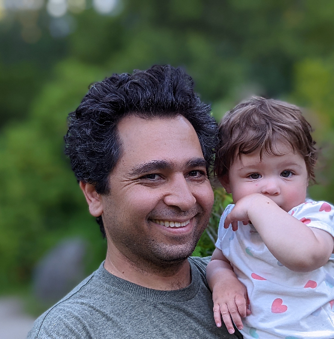
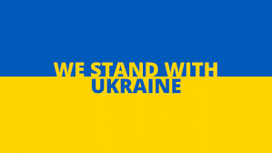
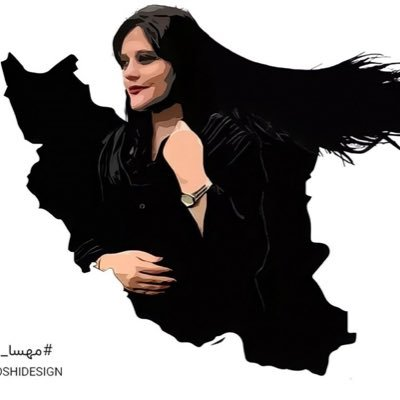
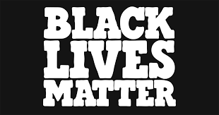
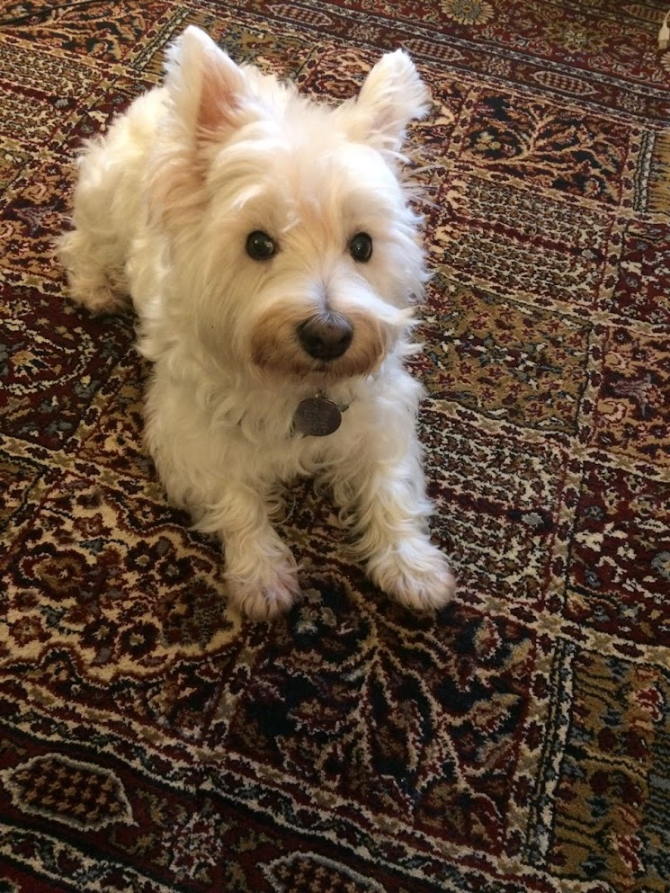

# Ali Khosro

Welcome To My [Website](https://storage.googleapis.com/khosro/index.html)   

## Profiles

-   [Resume](?file=resume)
-   [Github](https://github.com/alan-khosro)
-   [Stack Over Flow](https://stackoverflow.com/users/5078847/ali-khosro)
-   [Linkedin](https://www.linkedin.com/in/alikhosro/)
-   [My Book Shelf](?file=articles/my-book-shelf.md)

## Data Science Analysis

-   [Time Series Analysis](?file=web-visitors)
-   [Data Manupulation](?file=boston-crimes)

## Design Samples

-   [System Design Document](?file=order-prediction)
-   [Teapot](?file=articles/teapot-demo.md)

## Web Apps

-   [Text/Code Editor](./memo/src/index.html)
-   [Writer](./writer/src/index.html)
-   [Web Component: Table](https://alan-khosro.github.io/web-table/)
-   [Source Code and Content](https://console.cloud.google.com/storage/browser/khosro)

<!--

## Blog

-   [My Blog](https://modernapediary.wordpress.com/): Will move to a proper home soon. I write about software design, evolution, poetry, economics, and society.

-->

## Heart

<figure>
   
</figure>

It is not right to be indifferent. Although the social and political conflicts are very complicated and there are so many aspects and views that narrate different stories, it is not right to just be an observant of the history:

-   My heart goes out for Iranians who risk their lives and freedom to regain their freedom and democracy and push back the brutal theocratic regime.
-   Putin is the aggressor and I root for Ukrainins who fight for their country. Putin needs to stop invading neighboring countries.
-   Black Lives Matter. It is very clear that there is a systematic bias and discrimination against black comunities. It needs to end.
-   I miss my beloved dog: Scruffy!
