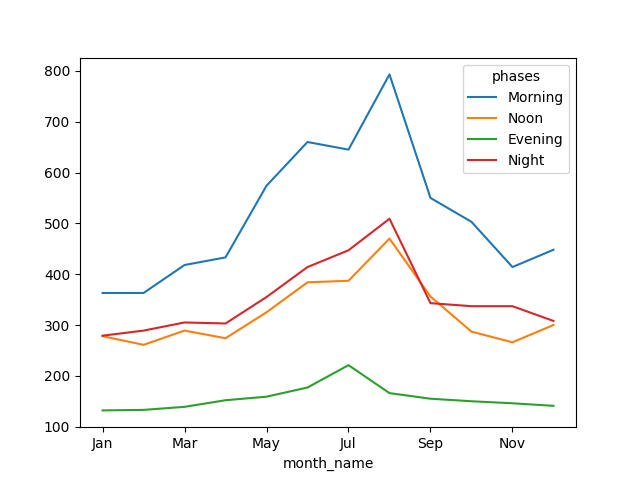

Internet Brands Use Case Analysis
========================
Ali Khosro   [Source Code](../analysis.py)    [Resume](https://alan-khosro.github.io/public/?file=resume)

Questions
----------------------------------
Use Boston Crime Dataset to answer each of the following questions:
- q1: Write a script that shows count of Auto Theft and Towed by Phase of Day (as index) vs Montn (as column)
- q2: Write script to get offense per district which has maximum occurrence in respective district
- q3: Add a column to data set which contains date of last incidents happened in respective district
- q4: Write a script to identify street having maximum number of incidents for every district
- q5: Create a subset of data, with only 10 recent incidents for each Street

Data Description
----------------------------------
<table>
  <thead>
    <tr>
      <th >&nbsp;</th>
      <th >OFFENSE_CODE</th>
      <th >YEAR</th>
      <th >MONTH</th>
      <th >HOUR</th>
      <th >Lat</th>
      <th >Long</th>
    </tr>
  </thead>
  <tbody>
    <tr>
      <th >count</th>
      <td >319073.0</td>
      <td >319073.0</td>
      <td >319073.0</td>
      <td >319073.0</td>
      <td >299074.0</td>
      <td >299074.0</td>
    </tr>
    <tr>
      <th >mean</th>
      <td >2317.5</td>
      <td >2016.6</td>
      <td >6.6</td>
      <td >13.1</td>
      <td >42.2</td>
      <td >-70.9</td>
    </tr>
    <tr>
      <th >std</th>
      <td >1185.3</td>
      <td >1.0</td>
      <td >3.3</td>
      <td >6.3</td>
      <td >2.2</td>
      <td >3.5</td>
    </tr>
    <tr>
      <th >min</th>
      <td >111.0</td>
      <td >2015.0</td>
      <td >1.0</td>
      <td >0.0</td>
      <td >-1.0</td>
      <td >-71.2</td>
    </tr>
    <tr>
      <th >25%</th>
      <td >1001.0</td>
      <td >2016.0</td>
      <td >4.0</td>
      <td >9.0</td>
      <td >42.3</td>
      <td >-71.1</td>
    </tr>
    <tr>
      <th >50%</th>
      <td >2907.0</td>
      <td >2017.0</td>
      <td >7.0</td>
      <td >14.0</td>
      <td >42.3</td>
      <td >-71.1</td>
    </tr>
    <tr>
      <th >75%</th>
      <td >3201.0</td>
      <td >2017.0</td>
      <td >9.0</td>
      <td >18.0</td>
      <td >42.3</td>
      <td >-71.1</td>
    </tr>
    <tr>
      <th >max</th>
      <td >3831.0</td>
      <td >2018.0</td>
      <td >12.0</td>
      <td >23.0</td>
      <td >42.4</td>
      <td >-1.0</td>
    </tr>
  </tbody>
</table>

### Data Cleaning:
- stripped whitespaces from STREET column
- converted OCCURRED_ON_DATE to datetime format
- mapped missing DISTRICT to 'not available' as a separate district to avoid unnecessary complications due to missing data

Q1: Crime Count
----------------------------------
The below shows the crime counts for Auto Theft and Towed offenses:

<table>
  <thead>
    <tr>
      <th >month_name</th>
      <th >Jan</th>
      <th >Feb</th>
      <th >Mar</th>
      <th >Apr</th>
      <th >May</th>
      <th >Jun</th>
      <th >Jul</th>
      <th >Aug</th>
      <th >Sep</th>
      <th >Oct</th>
      <th >Nov</th>
      <th >Dec</th>
    </tr>
    <tr>
      <th >phases</th>
      <th >&nbsp;</th>
      <th >&nbsp;</th>
      <th >&nbsp;</th>
      <th >&nbsp;</th>
      <th >&nbsp;</th>
      <th >&nbsp;</th>
      <th >&nbsp;</th>
      <th >&nbsp;</th>
      <th >&nbsp;</th>
      <th >&nbsp;</th>
      <th >&nbsp;</th>
      <th >&nbsp;</th>
    </tr>
  </thead>
  <tbody>
    <tr>
      <th >Morning</th>
      <td >363</td>
      <td >363</td>
      <td >418</td>
      <td >433</td>
      <td >574</td>
      <td >660</td>
      <td >645</td>
      <td >793</td>
      <td >550</td>
      <td >503</td>
      <td >414</td>
      <td >448</td>
    </tr>
    <tr>
      <th >Noon</th>
      <td >278</td>
      <td >261</td>
      <td >289</td>
      <td >274</td>
      <td >325</td>
      <td >384</td>
      <td >387</td>
      <td >470</td>
      <td >356</td>
      <td >287</td>
      <td >266</td>
      <td >300</td>
    </tr>
    <tr>
      <th >Evening</th>
      <td >132</td>
      <td >133</td>
      <td >139</td>
      <td >152</td>
      <td >159</td>
      <td >177</td>
      <td >221</td>
      <td >166</td>
      <td >155</td>
      <td >150</td>
      <td >146</td>
      <td >141</td>
    </tr>
    <tr>
      <th >Night</th>
      <td >279</td>
      <td >289</td>
      <td >305</td>
      <td >303</td>
      <td >355</td>
      <td >414</td>
      <td >447</td>
      <td >509</td>
      <td >343</td>
      <td >337</td>
      <td >337</td>
      <td >308</td>
    </tr>
  </tbody>
</table>

Q2: Most Occurred Offense In A District
------------------------------
<table>
  <thead>
    <tr>
      <th >&nbsp;</th>
      <th >DISTRICT</th>
      <th >OFFENSE_CODE</th>
      <th >OFFENSE_DESCRIPTION</th>
      <th >size</th>
    </tr>
  </thead>
  <tbody>
    <tr>
      <th >23</th>
      <td >not available</td>
      <td >3831</td>
      <td >M/V - LEAVING SCENE - PROPERTY DAMAGE</td>
      <td >171</td>
    </tr>
    <tr>
      <th >263</th>
      <td >E5</td>
      <td >3006</td>
      <td >SICK/INJURED/MEDICAL - PERSON</td>
      <td >1187</td>
    </tr>
    <tr>
      <th >67</th>
      <td >E18</td>
      <td >3006</td>
      <td >SICK/INJURED/MEDICAL - PERSON</td>
      <td >1349</td>
    </tr>
    <tr>
      <th >60</th>
      <td >E13</td>
      <td >3006</td>
      <td >SICK/INJURED/MEDICAL - PERSON</td>
      <td >1127</td>
    </tr>
    <tr>
      <th >65</th>
      <td >D4</td>
      <td >613</td>
      <td >LARCENY SHOPLIFTING</td>
      <td >3219</td>
    </tr>
    <tr>
      <th >122</th>
      <td >D14</td>
      <td >3410</td>
      <td >TOWED MOTOR VEHICLE</td>
      <td >1487</td>
    </tr>
    <tr>
      <th >238</th>
      <td >C6</td>
      <td >3006</td>
      <td >SICK/INJURED/MEDICAL - PERSON</td>
      <td >1508</td>
    </tr>
    <tr>
      <th >86</th>
      <td >C11</td>
      <td >3831</td>
      <td >M/V - LEAVING SCENE - PROPERTY DAMAGE</td>
      <td >2713</td>
    </tr>
    <tr>
      <th >45</th>
      <td >B3</td>
      <td >3301</td>
      <td >VERBAL DISPUTE</td>
      <td >2957</td>
    </tr>
    <tr>
      <th >7</th>
      <td >B2</td>
      <td >3301</td>
      <td >VERBAL DISPUTE</td>
      <td >3008</td>
    </tr>
    <tr>
      <th >96</th>
      <td >A7</td>
      <td >3006</td>
      <td >SICK/INJURED/MEDICAL - PERSON</td>
      <td >1040</td>
    </tr>
    <tr>
      <th >568</th>
      <td >A15</td>
      <td >3115</td>
      <td >INVESTIGATE PERSON</td>
      <td >464</td>
    </tr>
    <tr>
      <th >48</th>
      <td >A1</td>
      <td >802</td>
      <td >ASSAULT SIMPLE - BATTERY</td>
      <td >2146</td>
    </tr>
  </tbody>
</table>

Q3: Previous Incident Date In Each District
------------------------------
<table>
  <thead>
    <tr>
      <th >&nbsp;</th>
      <th >DISTRICT</th>
      <th >OCCURRED_ON_DATE</th>
      <th >OFFENSE_DESCRIPTION</th>
      <th >last_incident_date</th>
    </tr>
  </thead>
  <tbody>
    <tr>
      <th >0</th>
      <td >D14</td>
      <td >2018-09-02 13:00:00</td>
      <td >LARCENY ALL OTHERS</td>
      <td >2018-09-02 13:02:00</td>
    </tr>
    <tr>
      <th >1</th>
      <td >C11</td>
      <td >2018-08-21 00:00:00</td>
      <td >VANDALISM</td>
      <td >2018-08-21 00:00:00</td>
    </tr>
    <tr>
      <th >2</th>
      <td >D4</td>
      <td >2018-09-03 19:27:00</td>
      <td >TOWED MOTOR VEHICLE</td>
      <td >2018-09-03 19:58:00</td>
    </tr>
    <tr>
      <th >3</th>
      <td >D4</td>
      <td >2018-09-03 21:16:00</td>
      <td >INVESTIGATE PROPERTY</td>
      <td >NaT</td>
    </tr>
    <tr>
      <th >4</th>
      <td >B3</td>
      <td >2018-09-03 21:05:00</td>
      <td >INVESTIGATE PROPERTY</td>
      <td >NaT</td>
    </tr>
    <tr>
      <th >5</th>
      <td >C11</td>
      <td >2018-09-03 21:09:00</td>
      <td >M/V ACCIDENT INVOLVING PEDESTRIAN - INJURY</td>
      <td >NaT</td>
    </tr>
    <tr>
      <th >6</th>
      <td >B2</td>
      <td >2018-09-03 21:25:00</td>
      <td >AUTO THEFT</td>
      <td >NaT</td>
    </tr>
    <tr>
      <th >7</th>
      <td >B2</td>
      <td >2018-09-03 20:39:37</td>
      <td >VERBAL DISPUTE</td>
      <td >2018-09-03 21:25:00</td>
    </tr>
    <tr>
      <th >8</th>
      <td >C6</td>
      <td >2018-09-03 20:48:00</td>
      <td >ROBBERY - STREET</td>
      <td >NaT</td>
    </tr>
    <tr>
      <th >9</th>
      <td >C11</td>
      <td >2018-09-03 20:38:00</td>
      <td >VERBAL DISPUTE</td>
      <td >2018-09-03 21:09:00</td>
    </tr>
    <tr>
      <th >10</th>
      <td >C6</td>
      <td >2018-09-03 19:55:00</td>
      <td >VERBAL DISPUTE</td>
      <td >2018-09-03 20:19:00</td>
    </tr>
    <tr>
      <th >11</th>
      <td >C6</td>
      <td >2018-09-03 20:19:00</td>
      <td >INVESTIGATE PROPERTY</td>
      <td >2018-09-03 20:48:00</td>
    </tr>
    <tr>
      <th >12</th>
      <td >D4</td>
      <td >2018-09-03 19:58:00</td>
      <td >FIRE REPORT - HOUSE, BUILDING, ETC.</td>
      <td >2018-09-03 21:16:00</td>
    </tr>
    <tr>
      <th >13</th>
      <td >B3</td>
      <td >2018-09-03 20:39:00</td>
      <td >THREATS TO DO BODILY HARM</td>
      <td >2018-09-03 21:05:00</td>
    </tr>
    <tr>
      <th >14</th>
      <td >B3</td>
      <td >2018-09-02 14:00:00</td>
      <td >PROPERTY - LOST</td>
      <td >2018-09-02 14:33:00</td>
    </tr>
    <tr>
      <th >15</th>
      <td >not available</td>
      <td >2018-09-03 19:43:00</td>
      <td >SICK/INJURED/MEDICAL - PERSON</td>
      <td >NaT</td>
    </tr>
    <tr>
      <th >16</th>
      <td >C11</td>
      <td >2018-09-03 18:52:00</td>
      <td >VERBAL DISPUTE</td>
      <td >2018-09-03 19:11:00</td>
    </tr>
    <tr>
      <th >17</th>
      <td >D4</td>
      <td >2018-09-03 17:00:00</td>
      <td >DEMONSTRATIONS/RIOT</td>
      <td >2018-09-03 18:50:00</td>
    </tr>
    <tr>
      <th >18</th>
      <td >B2</td>
      <td >2018-09-03 19:52:00</td>
      <td >THREATS TO DO BODILY HARM</td>
      <td >2018-09-03 20:39:37</td>
    </tr>
    <tr>
      <th >19</th>
      <td >B2</td>
      <td >2018-09-02 18:00:00</td>
      <td >LARCENY THEFT FROM MV - NON-ACCESSORY</td>
      <td >2018-09-02 18:33:00</td>
    </tr>
    <tr>
      <th >...</th>
      <td >...</td>
      <td >...</td>
      <td >...</td>
      <td >...</td>
    </tr>
  </tbody>
</table>

Q4: Streets With Highest Incidents In Each District
------------------------------
<table>
  <thead>
    <tr>
      <th >&nbsp;</th>
      <th >DISTRICT</th>
      <th >STREET</th>
      <th >size</th>
    </tr>
  </thead>
  <tbody>
    <tr>
      <th >1036</th>
      <td >not available</td>
      <td >WASHINGTON</td>
      <td >16</td>
    </tr>
    <tr>
      <th >22</th>
      <td >E5</td>
      <td >WASHINGTON ST</td>
      <td >1624</td>
    </tr>
    <tr>
      <th >201</th>
      <td >E18</td>
      <td >HYDE PARK AVE</td>
      <td >3000</td>
    </tr>
    <tr>
      <th >52</th>
      <td >E13</td>
      <td >CENTRE ST</td>
      <td >2240</td>
    </tr>
    <tr>
      <th >102</th>
      <td >D4</td>
      <td >BOYLSTON ST</td>
      <td >5100</td>
    </tr>
    <tr>
      <th >205</th>
      <td >D14</td>
      <td >COMMONWEALTH AVE</td>
      <td >2769</td>
    </tr>
    <tr>
      <th >8</th>
      <td >C6</td>
      <td >MASSACHUSETTS AVE</td>
      <td >1881</td>
    </tr>
    <tr>
      <th >90</th>
      <td >C11</td>
      <td >DORCHESTER AVE</td>
      <td >4368</td>
    </tr>
    <tr>
      <th >26</th>
      <td >B3</td>
      <td >BLUE HILL AVE</td>
      <td >4952</td>
    </tr>
    <tr>
      <th >80</th>
      <td >B2</td>
      <td >BLUE HILL AVE</td>
      <td >2837</td>
    </tr>
    <tr>
      <th >295</th>
      <td >A7</td>
      <td >BORDER ST</td>
      <td >1206</td>
    </tr>
    <tr>
      <th >530</th>
      <td >A15</td>
      <td >BUNKER HILL ST</td>
      <td >469</td>
    </tr>
    <tr>
      <th >206</th>
      <td >A1</td>
      <td >WASHINGTON ST</td>
      <td >2793</td>
    </tr>
  </tbody>
</table>

Q5: Recent Incidents For Each Street
------------------------------
<table>
  <thead>
    <tr>
      <th >&nbsp;</th>
      <th >INCIDENT_NUMBER</th>
      <th >OFFENSE_CODE</th>
      <th >OFFENSE_CODE_GROUP</th>
      <th >OFFENSE_DESCRIPTION</th>
      <th >DISTRICT</th>
      <th >REPORTING_AREA</th>
      <th >SHOOTING</th>
      <th >OCCURRED_ON_DATE</th>
      <th >YEAR</th>
      <th >MONTH</th>
      <th >DAY_OF_WEEK</th>
      <th >HOUR</th>
      <th >UCR_PART</th>
      <th >STREET</th>
      <th >Lat</th>
      <th >Long</th>
      <th >Location</th>
      <th >last_incident_date</th>
    </tr>
  </thead>
  <tbody>
    <tr>
      <th >53110</th>
      <td >I182014036</td>
      <td >2900</td>
      <td >Other</td>
      <td >VAL - VIOLATION OF AUTO LAW - OTHER</td>
      <td >E5</td>
      <td >673</td>
      <td >nan</td>
      <td >2018-02-22 13:42:00</td>
      <td >2018</td>
      <td >2</td>
      <td >Thursday</td>
      <td >13</td>
      <td >Part Two</td>
      <td >ZELLER ST</td>
      <td >42.3</td>
      <td >-71.1</td>
      <td >(42.29186602, -71.13635487)</td>
      <td >2018-02-23 11:52:00</td>
    </tr>
    <tr>
      <th >230423</th>
      <td >I162038409</td>
      <td >3831</td>
      <td >Motor Vehicle Accident Response</td>
      <td >M/V - LEAVING SCENE - PROPERTY DAMAGE</td>
      <td >E5</td>
      <td >673</td>
      <td >nan</td>
      <td >2016-05-16 15:45:00</td>
      <td >2016</td>
      <td >5</td>
      <td >Monday</td>
      <td >15</td>
      <td >Part Three</td>
      <td >ZELLER ST</td>
      <td >42.3</td>
      <td >-71.1</td>
      <td >(42.29186602, -71.13635487)</td>
      <td >2016-05-16 15:53:00</td>
    </tr>
    <tr>
      <th >820</th>
      <td >I182070035</td>
      <td >1810</td>
      <td >Drug Violation</td>
      <td >DRUGS - SALE / MANUFACTURING</td>
      <td >B2</td>
      <td >904</td>
      <td >nan</td>
      <td >2018-08-31 17:40:00</td>
      <td >2018</td>
      <td >8</td>
      <td >Friday</td>
      <td >17</td>
      <td >Part Two</td>
      <td >ZEIGLER ST</td>
      <td >42.3</td>
      <td >-71.1</td>
      <td >(42.32924494, -71.08200715)</td>
      <td >2018-08-31 17:40:00</td>
    </tr>
    <tr>
      <th >821</th>
      <td >I182070035</td>
      <td >1849</td>
      <td >Drug Violation</td>
      <td >DRUGS - POSS CLASS B - COCAINE, ETC.</td>
      <td >B2</td>
      <td >904</td>
      <td >nan</td>
      <td >2018-08-31 17:40:00</td>
      <td >2018</td>
      <td >8</td>
      <td >Friday</td>
      <td >17</td>
      <td >Part Two</td>
      <td >ZEIGLER ST</td>
      <td >42.3</td>
      <td >-71.1</td>
      <td >(42.32924494, -71.08200715)</td>
      <td >2018-08-31 18:02:00</td>
    </tr>
    <tr>
      <th >5078</th>
      <td >I182065344</td>
      <td >3006</td>
      <td >Medical Assistance</td>
      <td >SICK/INJURED/MEDICAL - PERSON</td>
      <td >B2</td>
      <td >279</td>
      <td >nan</td>
      <td >2018-08-16 10:36:00</td>
      <td >2018</td>
      <td >8</td>
      <td >Thursday</td>
      <td >10</td>
      <td >Part Three</td>
      <td >ZEIGLER ST</td>
      <td >42.3</td>
      <td >-71.1</td>
      <td >(42.32898193, -71.07956761)</td>
      <td >2018-08-16 10:47:00</td>
    </tr>
    <tr>
      <th >10586</th>
      <td >I182059294</td>
      <td >2646</td>
      <td >Liquor Violation</td>
      <td >LIQUOR - DRINKING IN PUBLIC</td>
      <td >B2</td>
      <td >280</td>
      <td >nan</td>
      <td >2018-07-27 15:00:00</td>
      <td >2018</td>
      <td >7</td>
      <td >Friday</td>
      <td >15</td>
      <td >Part Two</td>
      <td >ZEIGLER ST</td>
      <td >42.3</td>
      <td >-71.1</td>
      <td >(42.32950632, -71.08398018)</td>
      <td >2018-07-27 15:09:00</td>
    </tr>
    <tr>
      <th >9749</th>
      <td >I182060211</td>
      <td >3115</td>
      <td >Investigate Person</td>
      <td >INVESTIGATE PERSON</td>
      <td >B2</td>
      <td >280</td>
      <td >nan</td>
      <td >2018-07-27 14:50:00</td>
      <td >2018</td>
      <td >7</td>
      <td >Friday</td>
      <td >14</td>
      <td >Part Three</td>
      <td >ZEIGLER ST</td>
      <td >42.3</td>
      <td >-71.1</td>
      <td >(42.32950632, -71.08398018)</td>
      <td >2018-07-27 14:58:00</td>
    </tr>
    <tr>
      <th >13138</th>
      <td >I182056556</td>
      <td >2646</td>
      <td >Liquor Violation</td>
      <td >LIQUOR - DRINKING IN PUBLIC</td>
      <td >B2</td>
      <td >280</td>
      <td >nan</td>
      <td >2018-07-18 15:05:00</td>
      <td >2018</td>
      <td >7</td>
      <td >Wednesday</td>
      <td >15</td>
      <td >Part Two</td>
      <td >ZEIGLER ST</td>
      <td >42.3</td>
      <td >-71.1</td>
      <td >(42.32950632, -71.08398018)</td>
      <td >2018-07-18 16:27:00</td>
    </tr>
    <tr>
      <th >25379</th>
      <td >I182043620</td>
      <td >3301</td>
      <td >Verbal Disputes</td>
      <td >VERBAL DISPUTE</td>
      <td >B2</td>
      <td >904</td>
      <td >nan</td>
      <td >2018-06-06 07:35:00</td>
      <td >2018</td>
      <td >6</td>
      <td >Wednesday</td>
      <td >7</td>
      <td >Part Three</td>
      <td >ZEIGLER ST</td>
      <td >42.3</td>
      <td >-71.1</td>
      <td >(42.32924494, -71.08200715)</td>
      <td >2018-06-06 09:24:00</td>
    </tr>
    <tr>
      <th >25624</th>
      <td >I182043365</td>
      <td >413</td>
      <td >Aggravated Assault</td>
      <td >ASSAULT - AGGRAVATED - BATTERY</td>
      <td >B2</td>
      <td >904</td>
      <td >nan</td>
      <td >2018-06-05 12:37:00</td>
      <td >2018</td>
      <td >6</td>
      <td >Tuesday</td>
      <td >12</td>
      <td >Part One</td>
      <td >ZEIGLER ST</td>
      <td >42.3</td>
      <td >-71.1</td>
      <td >(42.32924494, -71.08200715)</td>
      <td >2018-06-05 12:38:00</td>
    </tr>
    <tr>
      <th >25980</th>
      <td >I182042987</td>
      <td >2646</td>
      <td >Liquor Violation</td>
      <td >LIQUOR - DRINKING IN PUBLIC</td>
      <td >B2</td>
      <td >280</td>
      <td >nan</td>
      <td >2018-06-04 07:29:00</td>
      <td >2018</td>
      <td >6</td>
      <td >Monday</td>
      <td >7</td>
      <td >Part Two</td>
      <td >ZEIGLER ST</td>
      <td >42.3</td>
      <td >-71.1</td>
      <td >(42.32950632, -71.08398018)</td>
      <td >2018-06-04 07:55:00</td>
    </tr>
    <tr>
      <th >27745</th>
      <td >I182041047</td>
      <td >3301</td>
      <td >Verbal Disputes</td>
      <td >VERBAL DISPUTE</td>
      <td >B2</td>
      <td >904</td>
      <td >nan</td>
      <td >2018-05-28 22:23:00</td>
      <td >2018</td>
      <td >5</td>
      <td >Monday</td>
      <td >22</td>
      <td >Part Three</td>
      <td >ZEIGLER ST</td>
      <td >42.3</td>
      <td >-71.1</td>
      <td >(42.32924494, -71.08200715)</td>
      <td >2018-05-28 23:07:00</td>
    </tr>
    <tr>
      <th >6733</th>
      <td >I182063547</td>
      <td >3831</td>
      <td >Motor Vehicle Accident Response</td>
      <td >M/V - LEAVING SCENE - PROPERTY DAMAGE</td>
      <td >E13</td>
      <td >610</td>
      <td >nan</td>
      <td >2018-08-10 10:25:00</td>
      <td >2018</td>
      <td >8</td>
      <td >Friday</td>
      <td >10</td>
      <td >Part Three</td>
      <td >ZAMORA ST</td>
      <td >42.3</td>
      <td >-71.1</td>
      <td >(42.32206713, -71.11296494)</td>
      <td >2018-08-10 11:07:00</td>
    </tr>
    <tr>
      <th >15246</th>
      <td >I182054325</td>
      <td >3831</td>
      <td >Motor Vehicle Accident Response</td>
      <td >M/V - LEAVING SCENE - PROPERTY DAMAGE</td>
      <td >E13</td>
      <td >610</td>
      <td >nan</td>
      <td >2018-06-30 12:00:00</td>
      <td >2018</td>
      <td >6</td>
      <td >Saturday</td>
      <td >12</td>
      <td >Part Three</td>
      <td >ZAMORA ST</td>
      <td >42.3</td>
      <td >-71.1</td>
      <td >(42.32206713, -71.11296494)</td>
      <td >2018-06-30 12:30:00</td>
    </tr>
    <tr>
      <th >28408</th>
      <td >I182040331</td>
      <td >3831</td>
      <td >Motor Vehicle Accident Response</td>
      <td >M/V - LEAVING SCENE - PROPERTY DAMAGE</td>
      <td >E13</td>
      <td >610</td>
      <td >nan</td>
      <td >2018-05-16 16:00:00</td>
      <td >2018</td>
      <td >5</td>
      <td >Wednesday</td>
      <td >16</td>
      <td >Part Three</td>
      <td >ZAMORA ST</td>
      <td >42.3</td>
      <td >-71.1</td>
      <td >(42.32206713, -71.11296494)</td>
      <td >2018-05-16 17:07:00</td>
    </tr>
    <tr>
      <th >51068</th>
      <td >I182016227</td>
      <td >3106</td>
      <td >Property Related Damage</td>
      <td >PROPERTY - ACCIDENTAL DAMAGE</td>
      <td >E13</td>
      <td >610</td>
      <td >nan</td>
      <td >2018-03-02 13:56:00</td>
      <td >2018</td>
      <td >3</td>
      <td >Friday</td>
      <td >13</td>
      <td >Part Three</td>
      <td >ZAMORA ST</td>
      <td >42.3</td>
      <td >-71.1</td>
      <td >(42.32206713, -71.11296494)</td>
      <td >2018-03-02 13:58:00</td>
    </tr>
    <tr>
      <th >105869</th>
      <td >I172065449</td>
      <td >3410</td>
      <td >Towed</td>
      <td >TOWED MOTOR VEHICLE</td>
      <td >E13</td>
      <td >610</td>
      <td >nan</td>
      <td >2017-08-10 09:31:00</td>
      <td >2017</td>
      <td >8</td>
      <td >Thursday</td>
      <td >9</td>
      <td >Part Three</td>
      <td >ZAMORA ST</td>
      <td >42.3</td>
      <td >-71.1</td>
      <td >(42.32206713, -71.11296494)</td>
      <td >2017-08-10 09:35:00</td>
    </tr>
    <tr>
      <th >114818</th>
      <td >I172055934</td>
      <td >3410</td>
      <td >Towed</td>
      <td >TOWED MOTOR VEHICLE</td>
      <td >E13</td>
      <td >610</td>
      <td >nan</td>
      <td >2017-07-11 08:31:00</td>
      <td >2017</td>
      <td >7</td>
      <td >Tuesday</td>
      <td >8</td>
      <td >Part Three</td>
      <td >ZAMORA ST</td>
      <td >42.3</td>
      <td >-71.1</td>
      <td >(42.32206713, -71.11296494)</td>
      <td >2017-07-11 09:00:00</td>
    </tr>
    <tr>
      <th >152515</th>
      <td >I172015559</td>
      <td >3114</td>
      <td >Investigate Property</td>
      <td >INVESTIGATE PROPERTY</td>
      <td >E13</td>
      <td >610</td>
      <td >nan</td>
      <td >2017-02-26 03:27:00</td>
      <td >2017</td>
      <td >2</td>
      <td >Sunday</td>
      <td >3</td>
      <td >Part Three</td>
      <td >ZAMORA ST</td>
      <td >42.3</td>
      <td >-71.1</td>
      <td >(42.32206713, -71.11296494)</td>
      <td >2017-02-26 08:50:00</td>
    </tr>
    <tr>
      <th >169672</th>
      <td >I162103740</td>
      <td >3006</td>
      <td >Medical Assistance</td>
      <td >SICK/INJURED/MEDICAL - PERSON</td>
      <td >E13</td>
      <td >610</td>
      <td >nan</td>
      <td >2016-12-21 08:18:00</td>
      <td >2016</td>
      <td >12</td>
      <td >Wednesday</td>
      <td >8</td>
      <td >Part Three</td>
      <td >ZAMORA ST</td>
      <td >42.3</td>
      <td >-71.1</td>
      <td >(42.32206713, -71.11296494)</td>
      <td >2016-12-21 11:06:00</td>
    </tr>
    <tr>
      <th >...</th>
      <td >...</td>
      <td >...</td>
      <td >...</td>
      <td >...</td>
      <td >...</td>
      <td >...</td>
      <td >...</td>
      <td >...</td>
      <td >...</td>
      <td >...</td>
      <td >...</td>
      <td >...</td>
      <td >...</td>
      <td >...</td>
      <td >...</td>
      <td >...</td>
      <td >...</td>
      <td >...</td>
    </tr>
  </tbody>
</table>

