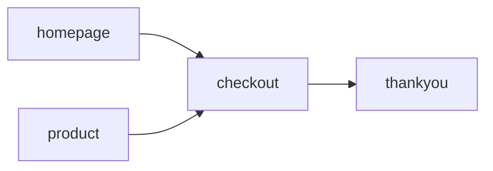
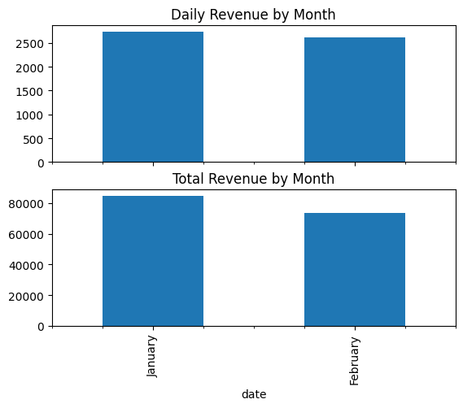
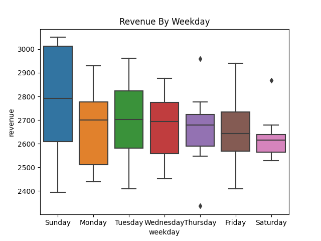
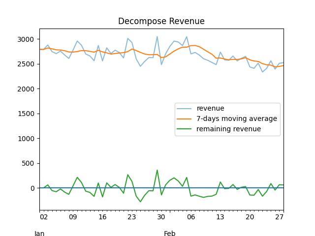
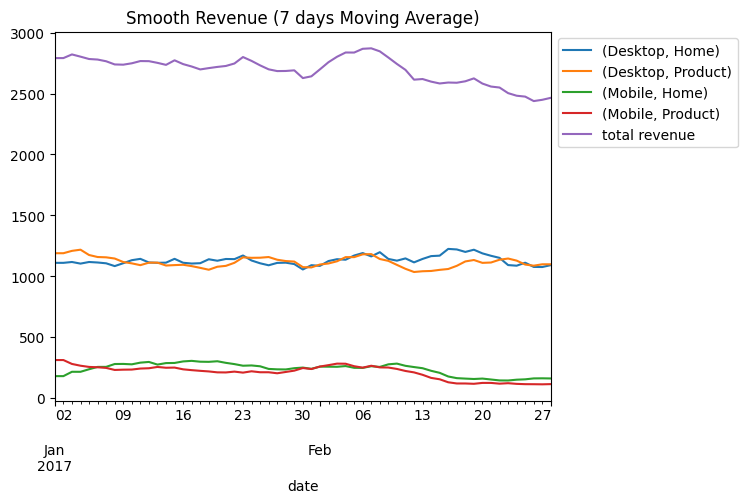
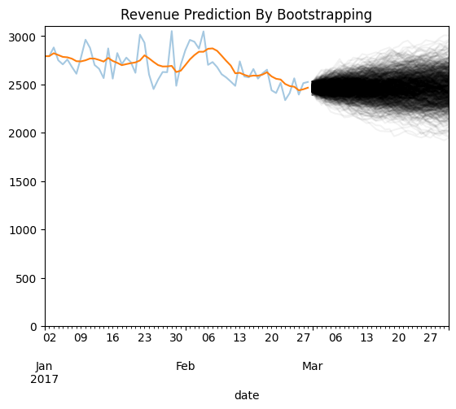
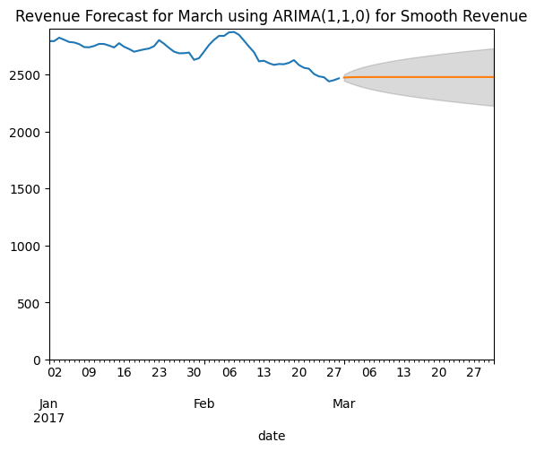
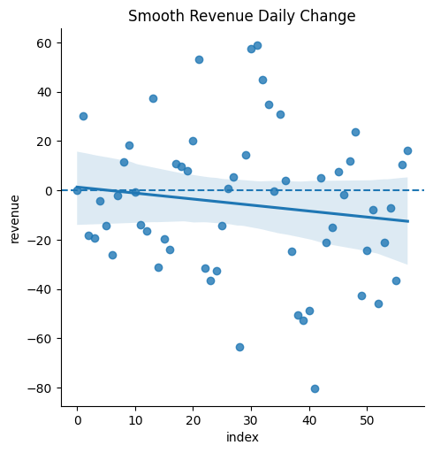
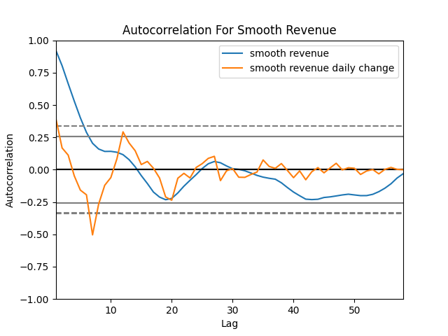

# Internet Brands Use Case Analysis
Author: Ali Khosro

- [Executive Summary](#executive-summary)
- [Important KPIs](#important-kpis)
- [Priliminary Analysis](#priliminary-analysis)
- [Moving Average Analysis](#moving-average-analysis)
- [Forecast Next Month](#forecast-next-month-revenue)
- [Attachment](#attachment-arima-selection)


## Executive Summary
### Data Summary
- Conversion Rates from landing to checkout **about 15%** and from checkout to thankyou **about 20%** are similar among all groups
- Page visits are similar among all groups (about **1300 pageviews per day**)
- Revenue from **Desktop revenue contribute to 85%** of the total revenue. Total daily revenue is about **2700** dollars.
- The revenue rates similarly are about 5 times higher for the Desktop visits (about **95 cents** for each Desktop visit and **16 cents** for each Mobile visit)

### Trends
- January daily revenue is only 4% higher than February but since February had 28 days and January had 31 days, the total monthly revenue gap seems higher 13% lower.
- Sundays have higher revenue and Saturdays have lower revenue than weekdays.
- There has been a significant drop especially for the Mobile visits after the second week of February. It is not a trend, just a drop.
- However, a drop in visits did **not** reduce the total revenue significantly since most such visits seem to not have been converted to shopping.
- **There is no persistent trend (drift) in revenue**, only occasional up and downs in the past especially a drop for the Mobile visits in the second week of February.

### Forecast
- 7-days moving average seems to smooth out the revenue and remove seasonality and noise very well
- The latest 7-day moving average of revenue is a very good predictor for future revenues.
- For March, average revenue forecast is **$76411** and with 95% confidence it would be between **70012 and 82810**

### KPIs to monitor
The following KPIs based on **7-days moving average** are crucial to monitor on a dashboard drilled down by device and landing_page to detect changes and trends:
- Total Revenue
- Revenue by device and landing_page
- revenue per landing
- revenue per thankyou
- landing to checkout conversion rate
- checkout to thankyou conversion rate
- pageviews for each landing page


## Data Science Report
- Input dataset: revenue and site visit data for Jan and Feb 2017
- Analysis Questions:
    - we are seeing lower revenue for Feb 2017, is it a valid concern?
    - predict March 2017 revenue
    - what other insights and suggestions can you extract?
    - What KPIs would you suggest to monitor?
- Sections:
    - Executive Summary
    - Detailed Analysis
- Process Flow



## Important KPIs
After cleaning up our dataset, we define the main KPIs that we need to monitor over time.
- Revenue Rate KPIs:
    - **revenue per landing**
    - revenue per checkout
    - **revenue per thankyou**
- Conversion Rate KPIs:
    - **landing to checkout conversion rate**
    - **checkout to thankyou conversion rate**
- Page View KPIs:
	- **pageviews for each landing page**
	- pageviews for thank you page
	- pageviews for checkout page
- Revenue KPIs:
	- **Total Revenue**
	- **Revenue by device and landing_page**
	- Total Revenue by weekday

It is important to track above important KPIs by device and by landing page


### Dataset Summary:
```
       landing_pageviews  checkout_pageviews  thankyou_pageviews  revenue  revenue_per_landing  revenue_per_checkout  revenue_per_thankyou  checkout_conversion  thankyou_conversion
count             236.00              236.00              236.00   236.00               236.00                236.00                236.00               236.00               236.00
mean            1,260.27              178.84               34.60   669.73                 0.57                  3.90                 19.67                 0.14                 0.19
std               193.51               30.77                8.21   460.47                 0.45                  2.93                 14.32                 0.01                 0.03
min               675.00              102.00               16.00    83.00                 0.07                  0.59                  4.50                 0.11                 0.11
25%             1,202.00              155.00               28.00   214.00                 0.15                  1.16                  6.09                 0.13                 0.20
50%             1,298.50              182.00               37.00   648.00                 0.49                  3.61                 16.84                 0.15                 0.20
75%             1,411.75              204.00               41.00 1,110.00                 0.89                  5.94                 29.16                 0.15                 0.20
max             1,499.00              225.00               48.00 1,350.00                 1.66                 11.09                 55.00                 0.15                 0.29
```

### Summary By Dimensions
Let us look at the aggregated average by device and landing page:
```
                      landing_pageviews  checkout_pageviews  thankyou_pageviews  revenue  revenue_per_landing  revenue_per_checkout  revenue_per_thankyou  checkout_conversion  thankyou_conversion
device  landing_page                                                                                                                                                                               
Desktop Home                   1,006.24              150.63               30.20 1,129.78                 1.16                  7.73                 38.58                 0.15                 0.20
        Product                1,365.71              204.53               41.17 1,111.27                 0.81                  5.44                 27.01                 0.15                 0.20
Mobile  Home                   1,348.29              202.00               35.59   234.95                 0.17                  1.16                  6.60                 0.15                 0.18
        Product                1,320.83              158.22               31.44   202.92                 0.15                  1.27                  6.48                 0.12                 0.20
```

### Highlighted Observations
We notice the following important observations:
> - Conversion Rates from landing to checkout (about 15%) and from checkout to thankyou (about 20%) are similar among all groups
> - Page visits are similar among all groups
> - Revenue from Desktop are much higher than revenue from Mobile (about 5 time higher)
> - The revenue rates similarly are about 5 times higher for the Desktop visits


## Priliminary Analysis
### February Revenue vs January Revenue
Is lower February revenue a valid concern?
The following graph shows the average daily revenue in February is not much lower than January revenue. 

> January daily revenue is only 4% higher than February but since February had 28 days and January had 31 days, the total monthly revenue gap seems higher 13% lower.

### Weekday Seasonality
Our data has weekday seasonality that is shown in the below graph.



As we see in the picture the revenue by weekday is different. For example, 
> Sundays have higher revenue and Saturdays have lower revenue than weekdays.
Since our prediction is not for a specific day but rather for a month, we can remove the seasonality by 7-days moving averge to achieve a smooth revenue that is easier to predict.

## Moving Average Analysis
Since we have weekday seasonality, it is intuitive to use 7-days moving average of revenue for predictions.

### Decompose Revenue Components
Before jumping into prediction, it is useful to look at the total revenue, its moving average, and its fluctuations in one graph.


We notice two important points about this transformation
> - 7-days moving average seems to smooth out the revenue and remove seasonality and noise very well
- It appears to be a downward drift in our moving average revenue
We will explore the second observation before predicting next month revenue 


### No Trend In Reveneue Components
We can investigate revenue components (by device and landing page) to see if there is a downward trend in any of the components.

The upper plots the raw revenue and the lower plots the smooth revenue (7-days moving average revenue) by device and landing page alongside the total revenue for each day.


While the total revenue shows a slight downward trend (drift), its components shows no trend, only occasional drops. In second week of February we see a drop in revenue for Mobile devices.

> There is no persistent trend (drift) in revenue, only occasional drops in the past especially for the Mobile visits in the second week of February.


## Forecast Next Month Revenue

### Forecast Revenue By Theoretical Insight
The underlying hypothesis for using the latest (moving average) observation is that our (revenue) observations follow a Markov Process, very much like what we observe in the stock market: while there might be a trend in the past prices, yet the latest observation is the most reliable prediction for future (efficient market hypothesis in economics).
The confidence interval can be calculated easily by knowing that standard deviation is a square root of time multiply daily standard deviation.

> mean revenue prediction: **76411**
> lower (95%) revenue prediction: **70012**
> upper revenue prediction: **82810**


### Forecast Revenue Through Bootstrapping
I am a big fan of using [bootstrapping](https://en.wikipedia.org/wiki/Bootstrapping_(statistics)) method. Let us use this method with 7-days moving average to predict next month revenue. First we remove the drift so we can draw from the past observations. Then we simulate the predictions 1000 times, each time we draw the past change of smooth revenue.


> Next month revenue is **76392** with 95% probability it will be between **70685** and **82335**

### Forecast Revenu Using ARIMA For Smooth Revenue
From insight we can conclude that 7-day moving average of revenue just need one degree difference to become stationary and ready for prediction and it will only have one lag autoregression:
> ARIMA(1,1,0) for smooth revenue is our best model selection
For an elaborate on how we reach to this conclusion, please refer to [attachement](#attachment-arima-selection)


> The total revenue forecast for March is **76752** dollars

## Attachment: ARIMA Selection
First we show there is no drift in 7-days moving average of revenue. Then, we show one degree difference is enough to make it stationary and perfect for ARIMA prediction. At the ned we run the ARIMA model selection based on AIC criteria.

### No Drift
Let us look at closer at the total revenue to see if there is any trend (drift) in our time series dataset.
> Null Hypothesis: there is no (linear) drift in revenue
One way to investigate is to plot daily changes of smooth revenue (today smooth revenue minus yesterday). If there is a (linear) trend, the (99%) confidence interval of the linear regression will **not** include the horizontal line $y = 0$.


The confidence interval of linear regression for daily change of smooth revenue includes the horizental like $y = 0$ so we can not reject the null hypothesis:
> There is no drif in revenue

### Transformation Selection
The graph below shows the autocorrelation for 7-days moving average revenue and its one degree difference transformation: daily changes of smooth revenue.


It is evident that while the smooth revenue is significantly autocorrelated up to past 5 lags, its one degree difference has no significant autocorrelation. It shows that "daily change of smooth revenue" is a very good transformation that removes the autocorrelation problem.
> The daily changes of 7-days moving average revenue has no significant autocorrelation and it is stationary


### ARIMA Parameters Selection
We use ARIMA(p,d,q) for prediction with following parameters:
- q = 0: we already used 7-days moving average
- p, d: select p,d that gives lowest AIC

The model selection criteria (AIC) for no transformation (q=0) gives:
```
[561.1191743021827, 552.3341396239078, 554.2318496660034, 556.0855352357928, 557.2444895946495]
```
The model selection criteria (AIC) for one degree transformation (q=1) gives:
```
[725.8824945785715, 577.3518513704868, 566.8850221040954, 568.2268061556507, 569.4525744242924]
```
So the selected ARIMA model for 7-days moving average of revenue is
ARIMA(1,1,0)
```
                               SARIMAX Results                                
==============================================================================
Dep. Variable:                revenue   No. Observations:                   59
Model:                 ARIMA(1, 1, 0)   Log Likelihood                -274.167
Date:                Tue, 30 Aug 2022   AIC                            552.334
Time:                        09:37:56   BIC                            556.455
Sample:                    01-01-2017   HQIC                           553.939
                         - 02-28-2017                                         
Covariance Type:                  opg                                         
==============================================================================
                 coef    std err          z      P>|z|      [0.025      0.975]
------------------------------------------------------------------------------
ar.L1          0.4091      0.101      4.071      0.000       0.212       0.606
sigma2       744.6853    149.178      4.992      0.000     452.301    1037.070
===================================================================================
Ljung-Box (L1) (Q):                   0.04   Jarque-Bera (JB):                 0.72
Prob(Q):                              0.84   Prob(JB):                         0.70
Heteroskedasticity (H):               1.80   Skew:                            -0.20
Prob(H) (two-sided):                  0.21   Kurtosis:                         2.63
===================================================================================

Warnings:
[1] Covariance matrix calculated using the outer product of gradients (complex-step).
```

